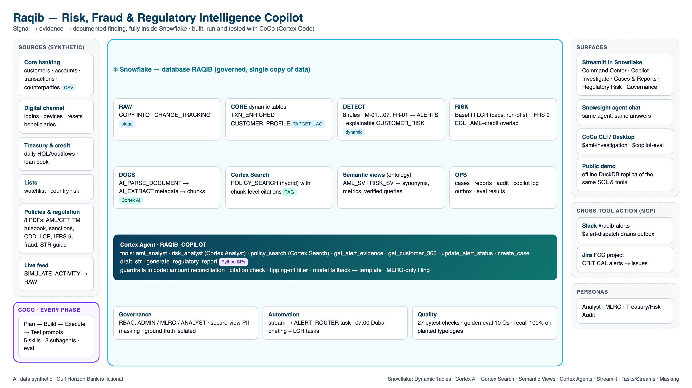

# 🛡️ Raqib — Risk, Fraud & Regulatory Intelligence Copilot

**Snowflake CoCo CLI Hackathon — GCC Edition · Problem 1: Risk, Fraud and Regulatory Intelligence Copilot**

Raqib (رقيب, "observer") helps a GCC bank's compliance, MLRO and treasury teams go from **signal → evidence → documented finding**:
- ask questions in plain English and get **governed, explainable, evidence-backed** answers;
- investigate alerts with transactions, the KYC profile, money-flow graphs and the **exact policy clause**;
- produce **audit-ready STRs and Basel III LCR / IFRS 9 reports** that are validated in code, not just prompted.

It is built, run and tested with **CoCo (Cortex Code)** across the whole lifecycle. All data is synthetic, and *Gulf Horizon Bank* is fictional.



| | |
|---|---|
| 🎥 Demo video | _add link_ |
| 🌐 Live app (Streamlit in Snowflake) | _add link_ |
| 🌐 Public demo (no login, offline replica) | _add Streamlit Community Cloud link_ |
| 📑 Submission deck | `docs/Raqib_submission_deck.pptx` |

## What's inside
| Layer | Snowflake features | Where |
|---|---|---|
| Synthetic data with ground truth | Stage + COPY | `data_gen/`, `sql/02` |
| Near-real-time pipeline | Dynamic tables (TARGET_LAG), change tracking | `sql/03` |
| Detection (8 rules) + explainable risk score | Dynamic tables, JAROWINKLER_SIMILARITY | `sql/04` |
| Basel III LCR, IFRS 9 ECL, AML–credit overlap | Views | `sql/05` |
| Policy intelligence (8 PDFs) | AI_PARSE_DOCUMENT, AI_EXTRACT, SPLIT_TEXT_RECURSIVE_CHARACTER, **Cortex Search** | `sql/06`, `policy_docs/` |
| Agent tools with guardrails | Python stored procedures, AI_COMPLETE (guardrails, model fallback) | `tools/raqib_tools.py`, `sql/07` |
| Governance | RBAC (Admin/MLRO/Analyst), PII tags + secure-view masking (Standard edition), caller's-rights approval | `sql/08` |
| Ontology | **Semantic views** with synonyms, metrics, verified queries | `sql/09` |
| Copilot | **Cortex Agent** with 2 Analyst tools, Search and 6 custom tools | `sql/10` |
| Automation | Stream + tasks (alert routing, 07:00 Dubai briefing), live-activity simulator | `sql/11` |
| App | **Streamlit in Snowflake**: Command Center, Copilot, Investigate, Cases & Reports, Regulatory Risk, Governance | `app/`, `sql/12` |
| CoCo | 5 skills, 3 subagents, phase prompts, MCP (Slack/Jira), scheduled runs, evidence log | `.cortex/`, `coco/`, `AGENTS.md` |
| Quality | 27 pytest checks, 10-question golden eval, recall/FP back-test | `tests/`, `eval/` |

## Results on the synthetic bank
- **100% recall** on 42 planted scenarios across all 8 rules. False positives are capped at 12 alerts per rule.
- The hero case (*Tariq Mahmoud Haddad*: structuring + Iran/Lebanon wires + sanctions near-match + profile deviation) is ranked **CRITICAL (100/100)**.
- An LCR stress episode is detected: **3 days below the 110% early-warning trigger** (trough 101.6%), with no breach of the 100% minimum.
- STR guardrails are tested against a deliberately hallucinating LLM. Invented amounts, fake citations and tipping-off advice are all caught and blocked from filing.
- Golden eval: **10/10 offline**. Re-run it live with `eval/run_eval.py --connection raqib`.

## Quick start (no Snowflake needed)
```bash
uv venv -p 3.11 .venv && uv pip install --python .venv/bin/python -r requirements-dev.txt
.venv/bin/python data_gen/generate.py && .venv/bin/python data_gen/build_pdfs.py
.venv/bin/python -m pytest tests -q                    # 27 passed
cd app && RAQIB_OFFLINE=1 ../.venv/bin/streamlit run streamlit_app.py
```

## Deploy to Snowflake (through CoCo)
1. **Account:** use a Snowflake account with Cortex Code access. Standard self-service trials do not include CoCo CLI. Use the hackathon credit link or the Cortex Code trial, enable Cortex AI features, and use an Enterprise edition region with Cortex availability.
2. **Install tools:**
   ```bash
   curl -LsS https://ai.snowflake.com/static/cc-scripts/install.sh | sh
   uv tool install snowflake-cli
   ```
3. **Connect:** generate a key pair, register the public key with `ALTER USER <you> SET RSA_PUBLIC_KEY='...'`, then create `~/.snowflake/connections.toml` (chmod 600):
   ```toml
   [raqib]
   account = "<ORG-ACCOUNT>"
   user = "<USER>"
   authenticator = "SNOWFLAKE_JWT"          # key-pair auth (trial accounts have no SSO)
   private_key_file = "~/.snowflake/keys/raqib_rsa_key.p8"
   role = "ACCOUNTADMIN"
   warehouse = "COMPUTE_WH"
   ```
4. **Build and run with CoCo:** start `cortex -c raqib` in the repo root and follow [`coco/README.md`](coco/README.md)
   phase by phase. Trial accounts must run CoCo interactively; headless `cortex exec` needs a paid account.
   `scripts/deploy.sh` is the same sequence as a plain script, for reference.
5. **Public demo:** deploy `app/streamlit_app.py` on Streamlit Community Cloud with env `RAQIB_OFFLINE=1`. It uses `requirements.txt` at the repo root.
6. **Stop credit burn after judging:** `scripts/teardown.sh` (or `--drop`).

## Repository map
See [`AGENTS.md`](AGENTS.md). Design: [`docs/solution_design.md`](docs/solution_design.md). Demo: [`docs/demo_script.md`](docs/demo_script.md).

## Disclaimer
Synthetic data and fictional institutions only. Policy documents are illustrative and modelled on public concepts (FATF, Basel III, IFRS 9, UAE AML/CFT framework). They are not legal or regulatory advice.
